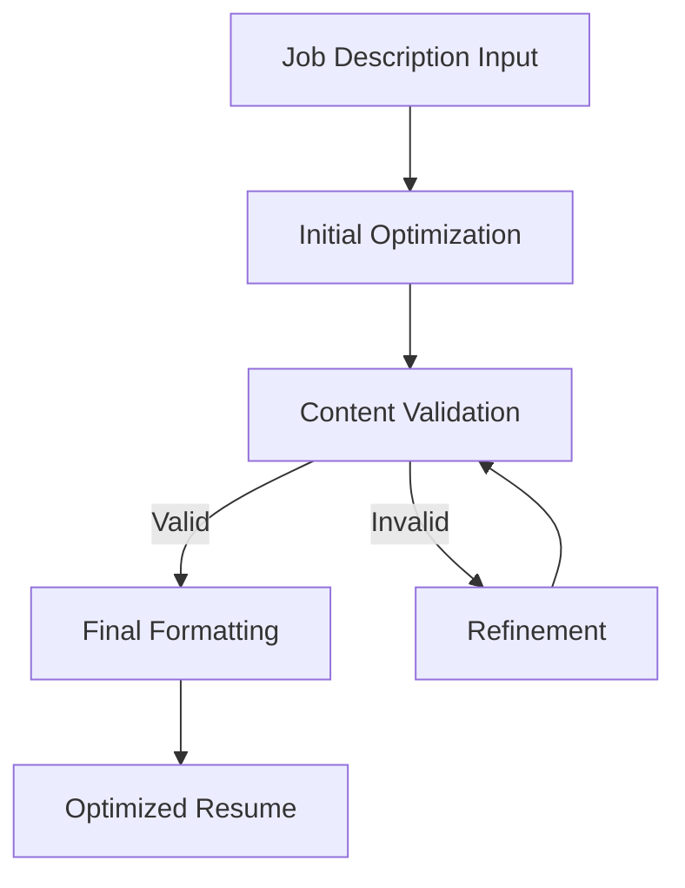

# AI Resume Optimization Pipeline

This document details the AI-powered resume optimization pipeline, including the roles of different models, validation processes, and optimization strategies.

## Pipeline Overview

The resume optimization process follows a multi-stage pipeline:

1. Initial Optimization
2. Validation
3. Refinement (if needed)
4. Final Formatting



## Model Roles

### 1. Optimization Model (Gemini-2.5-flash)

Primary model responsible for initial resume optimization.

**Key Tasks:**
- Analyze job description requirements
- Identify relevant experience and skills
- Rewrite content for keyword optimization
- Maintain professional tone and clarity

**Configuration:**
```yaml
resume_optimization:
  provider: "google"
  model: "gemini-2.5-flash"
  temperature: 0.7    # Higher creativity for content generation
  max_tokens: 2048    # Longer responses for detailed optimization
```

### 2. Validation Model (Gemini-2.0-flash)

Ensures accuracy and honesty of optimized content.

**Key Tasks:**
- Compare optimized content against original experiences
- Calculate dishonesty score
- Identify potential embellishments
- Validate technical accuracy

**Configuration:**
```yaml
resume_validation:
  provider: "google"
  model: "gemini-2.0-flash"
  temperature: 0.2    # Lower creativity for factual validation
  max_tokens: 1024    # Moderate length for validation responses
```

### 3. Refinement Model (Gemini-2.0-flash)

Handles iterative improvements when validation fails.

**Key Tasks:**
- Analyze validation failures
- Adjust content while maintaining accuracy
- Balance optimization with honesty
- Preserve original meaning

**Configuration:**
```yaml
resume_refinement:
  provider: "google"
  model: "gemini-2.0-flash"
  temperature: 0.5    # Balanced creativity for refinement
  max_tokens: 1024    # Moderate length for refinements
```

### 4. Formatting Model (Gemini-1.5-flash)

Ensures consistent formatting and presentation.

**Key Tasks:**
- Standardize bullet point structure
- Maintain consistent tense
- Apply formatting rules
- Check grammar and style

**Configuration:**
```yaml
resume_formatting:
  provider: "google"
  model: "gemini-1.5-flash"
  temperature: 0.3    # Lower creativity for consistent formatting
  max_tokens: 512     # Shorter responses for formatting tasks
```

## Validation Process

### Dishonesty Detection

The validation process uses a scoring system to detect potential dishonesty:

```python
class ValidationScore:
    PERFECT = 0
    MINOR_ENHANCEMENT = 10
    SIGNIFICANT_ENHANCEMENT = 20
    FABRICATION = 30
```

**Scoring Criteria:**
- Word choice enhancement: 5-10 points
- Skill level inflation: 10-15 points
- Experience fabrication: 30 points
- Technical inaccuracy: 20 points

### Validation Loop

```python
def validate_resume(content, original_experience, max_retries=5):
    for attempt in range(max_retries):
        score = validation_model.validate(content, original_experience)
        
        if score < THRESHOLD_SCORE:
            return True, content
            
        content = refinement_model.refine(
            content,
            validation_feedback,
            original_experience
        )
    
    return False, original_content  # Revert if validation fails
```

## Optimization Strategies

### 1. Selective Section Updates

The system uses a path-based syntax to target specific sections for optimization:

```yaml
sections_to_optimize:
  - "profile.description"        # Specific subsection
  - "skills"                     # Entire section
  - "experience[Company Name]"   # Specific experience entry
```

### 2. Keyword Optimization

The optimization model employs several strategies:

1. **Keyword Density Analysis**
   - Extract key requirements from job description
   - Calculate current keyword presence
   - Distribute keywords naturally

2. **Context-Aware Rewrites**
   - Maintain original meaning
   - Incorporate job-specific terminology
   - Preserve quantifiable achievements

3. **Technical Accuracy**
   - Validate technology mentions
   - Ensure version compatibility
   - Maintain technical context

### 3. Experience Matching

The system matches experiences to job requirements:

```python
def match_experience(job_reqs, experiences):
    matches = []
    for exp in experiences:
        score = calculate_relevance(job_reqs, exp)
        if score > MIN_RELEVANCE_SCORE:
            matches.append((exp, score))
    return sorted(matches, key=lambda x: x[1], reverse=True)
```

## Error Handling

### 1. Model Failures

```python
class ModelError(Exception):
    def __init__(self, model_name, error_type, details):
        self.model_name = model_name
        self.error_type = error_type
        self.details = details
```

The system handles various failure modes:

1. **API Errors**
   - Retry with exponential backoff
   - Fall back to alternate models
   - Log detailed error information

2. **Content Validation Failures**
   - Maximum retry attempts (configurable)
   - Reversion to original content
   - Detailed validation feedback

3. **Timeout Handling**
   - Configurable timeout per operation
   - Graceful degradation options
   - State recovery mechanisms

## Performance Optimization

### 1. Caching

```python
class OptimizationCache:
    def __init__(self):
        self.cache = {}
        self.ttl = 24 * 60 * 60  # 24 hours
        
    def get_cached_optimization(self, content_hash, job_req_hash):
        key = f"{content_hash}:{job_req_hash}"
        return self.cache.get(key)
```

### 2. Batch Processing

For multiple job applications:

```python
async def batch_optimize(resumes, job_descriptions):
    tasks = []
    for resume, job in zip(resumes, job_descriptions):
        task = asyncio.create_task(
            optimize_resume(resume, job)
        )
        tasks.append(task)
    return await asyncio.gather(*tasks)
```

## Development and Testing

### 1. Mock Models

For testing without API calls:

```python
class MockOptimizationModel:
    def optimize(self, content, job_desc):
        return {
            "optimized_content": content,
            "optimization_score": 0.85
        }
```

### 2. Validation Tests

```python
def test_validation_accuracy():
    original = load_test_resume()
    optimized = optimizer.optimize(original, job_desc)
    score = validator.validate(optimized, original)
    assert score < THRESHOLD_SCORE
```

## Monitoring and Logging

### 1. Optimization Metrics

```python
class OptimizationMetrics:
    def __init__(self):
        self.total_optimizations = 0
        self.validation_failures = 0
        self.average_score = 0.0
        self.model_latencies = {}
```

### 2. Log Format

```python
logging.info(
    "Optimization completed",
    extra={
        "original_length": len(original_content),
        "optimized_length": len(optimized_content),
        "validation_score": score,
        "optimization_time": duration,
        "model_used": model_name
    }
)
```

## Future Improvements

1. **Model Enhancements**
   - Fine-tuning on successful resumes
   - Industry-specific optimization patterns
   - Multi-language support

2. **Validation Improvements**
   - Enhanced dishonesty detection
   - Industry-specific validation rules
   - Automated fact-checking

3. **Performance Optimization**
   - Parallel validation processing
   - Improved caching strategies
   - Batch optimization enhancements 